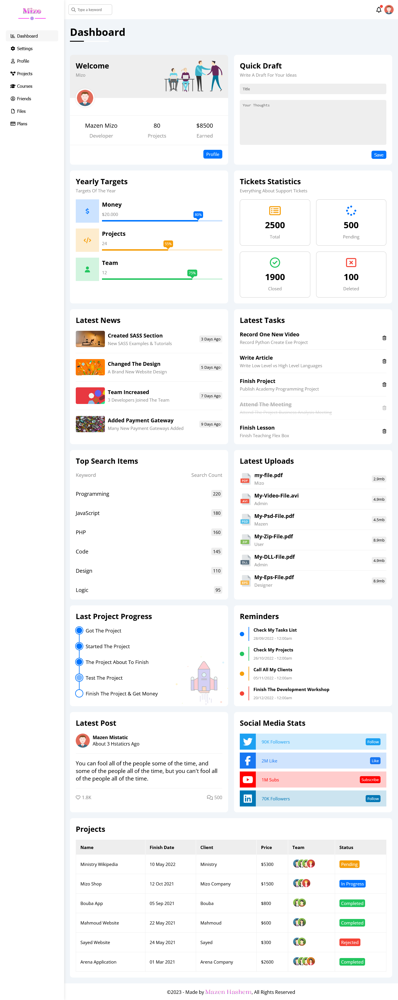
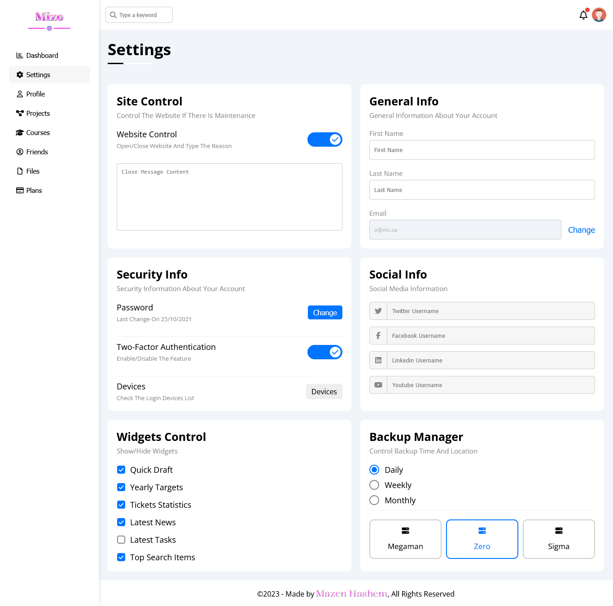
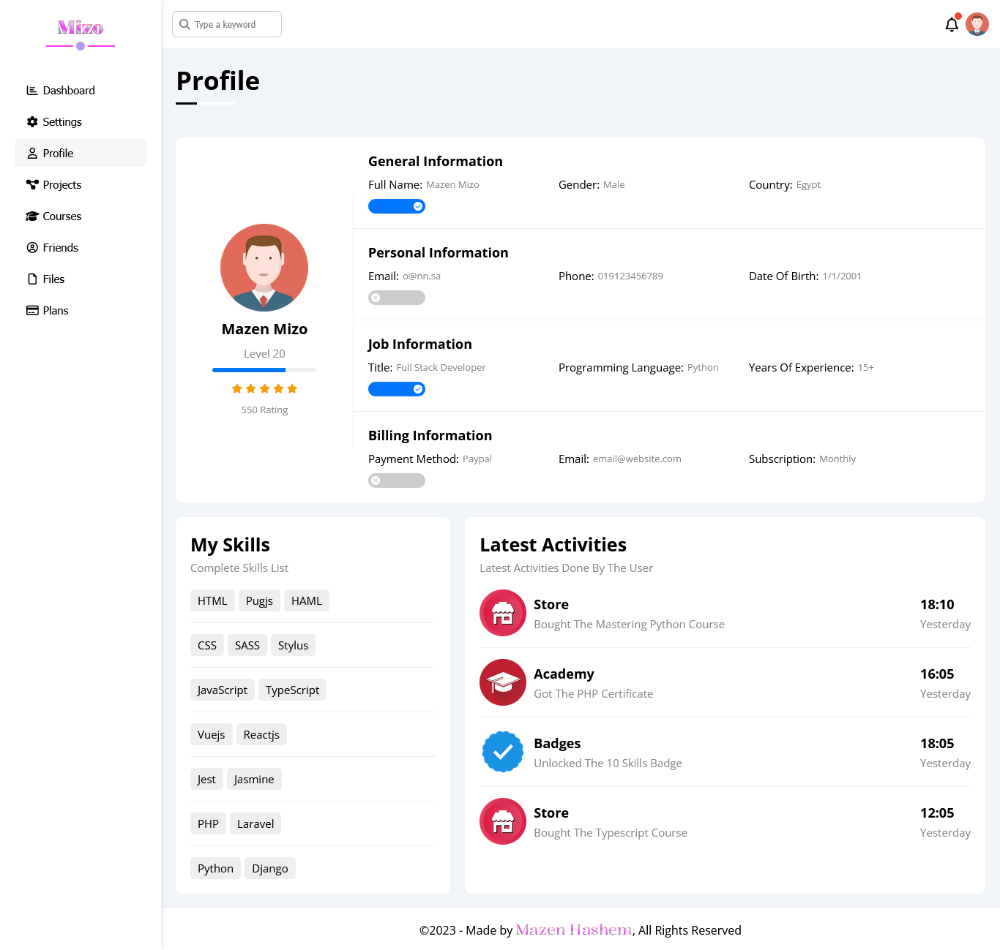
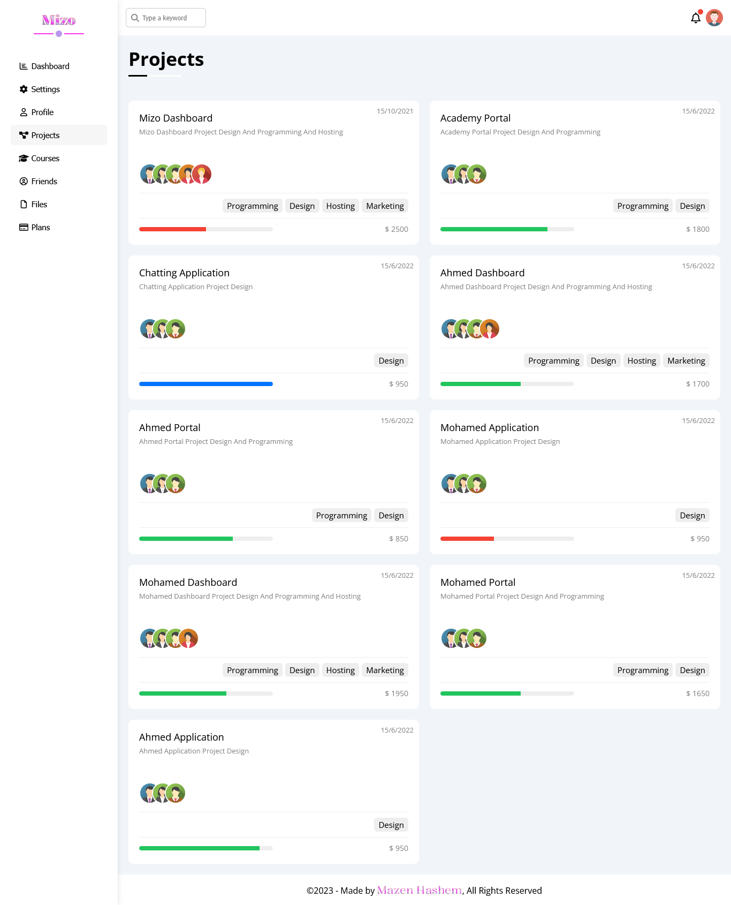
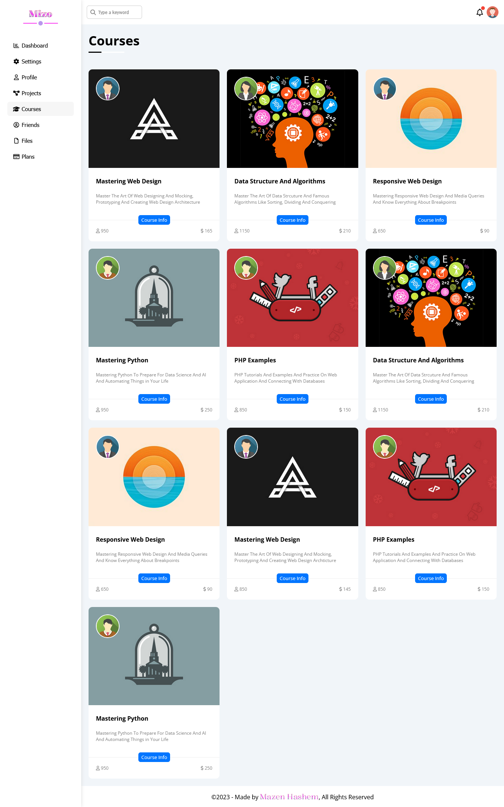
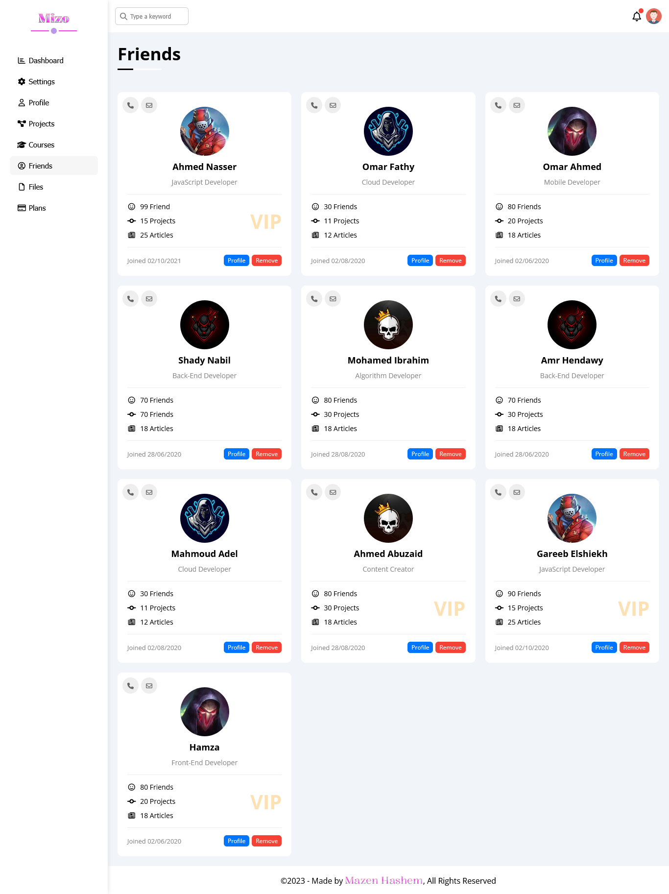
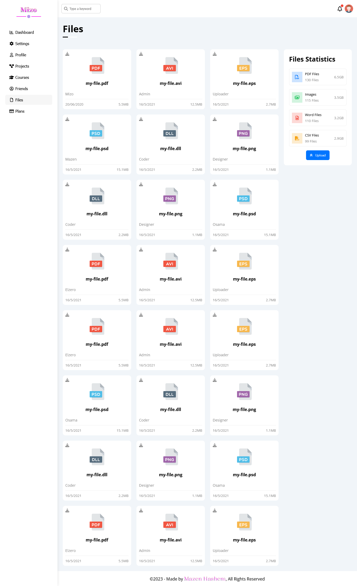
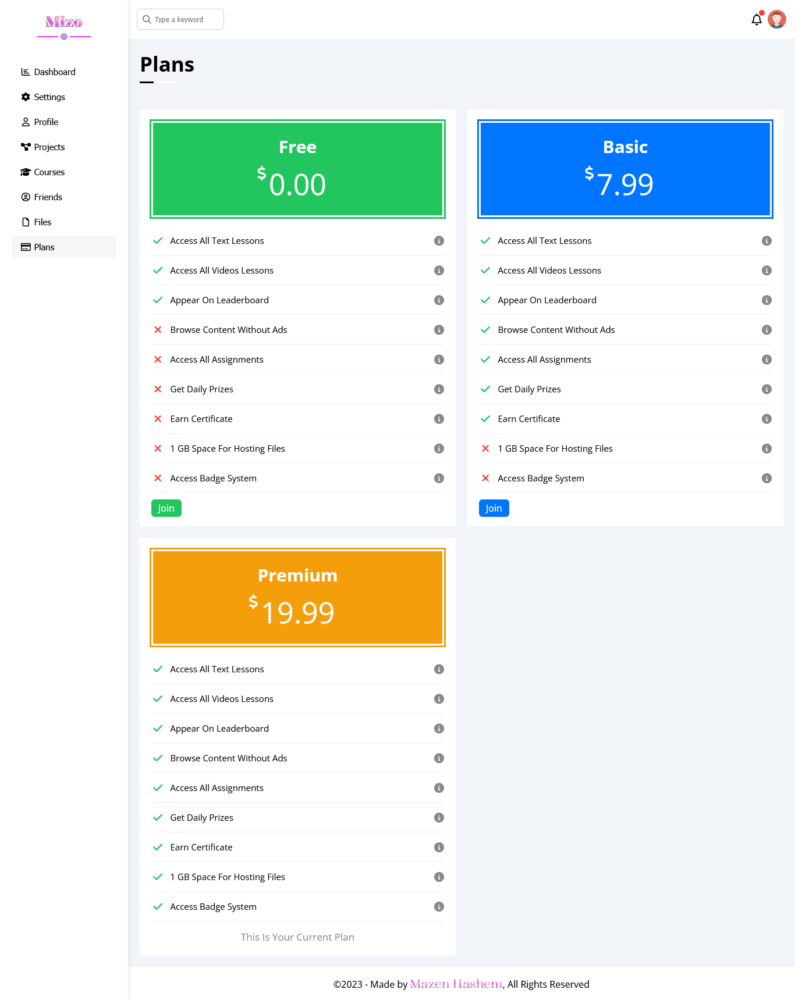

<h1>DashBoard</h1>

  

<h2>Description</h2>

  This is a DashBoard made by 
  <em>HTML</em> , 
  <em>CSS</em> and
  <em>JavaScript</em> languages.
  Inspired by 
  <strong>
    <a href="https://www.youtube.com/@ElzeroWebSchool">ElzeroWebSchool</a>
  </strong> 
  channel.

My goal from this project is to show my experience in Front-end web development.

<h3><u>Functionality buttons:</u></h3>
<ul>
  <li>Aside navbar buttons to change dashboard content.</li>
</ul>

- Other buttons and links just for design.

<h3><u>Animations:</u></h3>
<ul>
  <li>Simple hover animations.</li>
</ul>

<h3><u>Responsiveness:</u></h3>

  The website is responsive, it created to use across all devices, such as modern desktops, tablets, and phone browsers.

>Please note that all images, videos and contents in this project are random and just
to show the design and the functionality of the website.

<h2>Screenshot</h2>

<h3><u>Home:</u></h3>

<h3><u>Settings:</u></h3>

<h3><u>Profile:</u></h3>

<h3><u>Projects:</u></h3>

<h3><u>Courses:</u></h3>

<h3><u>Friends:</u></h3>

<h3><u>Files:</u></h3>

<h3><u>Plans:</u></h3>
